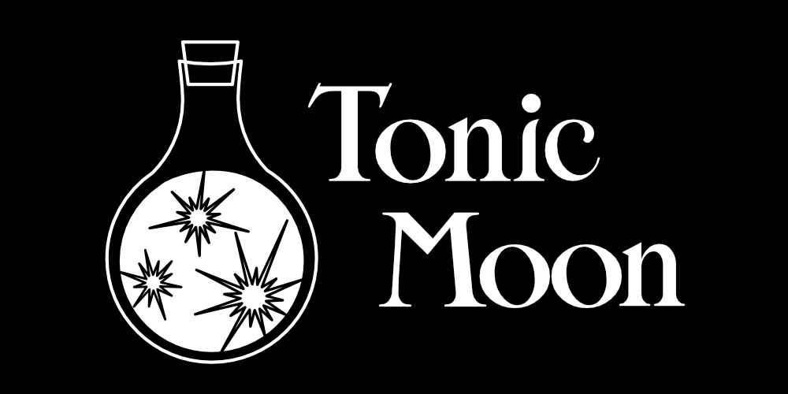
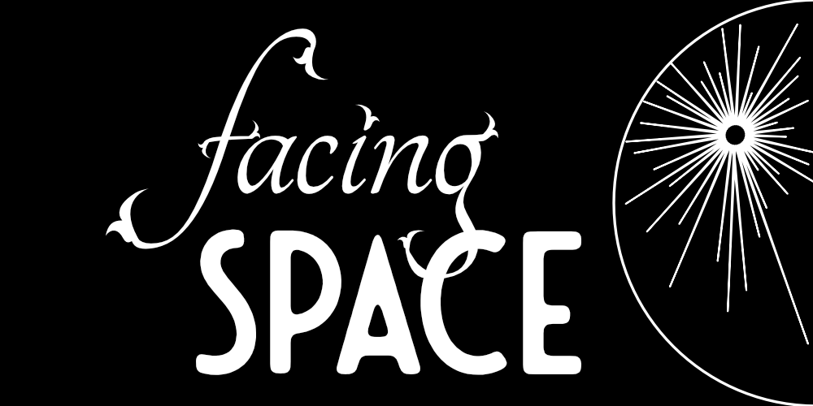

# Tonic Moon and Facing Space

In November 2021 I hooked up with the Tonic Moon development team to help produce Facing Space, a visual novel that we entered in the 2021 Cultural Heritage Game Jam, sponsored by the Cultural Antiquities Task Force (CATF), part of the U.S. Department of State’s Cultural Heritage Coordinating Committee. 
We all overlapped in our responsibilities a bit, but we had one person whose primary responsibility was narrative and logo design, one who did project management and visual assets, one who composed the music... and (over a period of four days) I was the coder who made it all come to life. :-)
You can download PC and Mac distros at https://itch.io/jam/cultural-heritage-game-jam/rate/1285745

